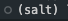
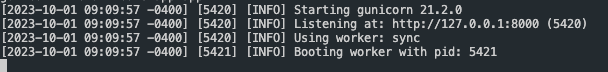

# Salt

Salt is a custom Python web framework built from scratch.

## Directory Structure
```
Salt/
├── Makefile
├── core/
│   ├── __init__.py
│   ├── app.py
│   └── tests/
│       ├── __init__.py
│       └── test.py
├── .gitignore
└── changelog.md
```


- `Makefile`: a file that contains instructions for the `make` utility
- `core/`: a directory that contains the core application code
- `core/__init__.py`: an empty file that marks the `core` directory as a Python package
- `core/app.py`: a file that contains the main application code
- `core/tests/`: a directory that contains the unit tests for the application
- `core/tests/__init__.py`: an empty file that marks the `tests` directory as a Python package
- `core/tests/test.py`: a file that contains the unit tests for the application
- `.gitignore`: a file that specifies files and directories that should be ignored by Git
- `changelog.md`: a file that contains a log of changes to the project
 

## Prerequisties

To run this project it's essential to create a sepperate envs where to store the all the project's dependencies.

- Install  `pip install virtualenvwrapper`
- Follow this instructions: source[virtualenvwraper]('https://virtualenvwrapper.readthedocs.io/en/latest/') to create a virtual env wrappper named `salt`
```
$    export WORKON_HOME=~/Envs
$    mkdir -p $WORKON_HOME
$    which virtualenvwrapper.sh
$    source {printed/virual/path}/virtualenvwrapper.sh
```

- Activate `salt` and you will see this(Fig 1.1)




- if you ever get out of the enviroment feel free to activate it by `workon salt`


Now that you have setup the salt env you will have access to the Make file commands
which will make it easier to manage the project

_if make commands to do work ensure that they can be executed `chmod +x Makefile`_


# Start
Unload the projects dependies in the project
`make install`

Run the project Fig:1.2
`make app`





To give better context of this project I follow [Convetional Commits]('https://www.conventionalcommits.org/en/v1.0.0/'] to give context to the evolution of changes throught out the project.

